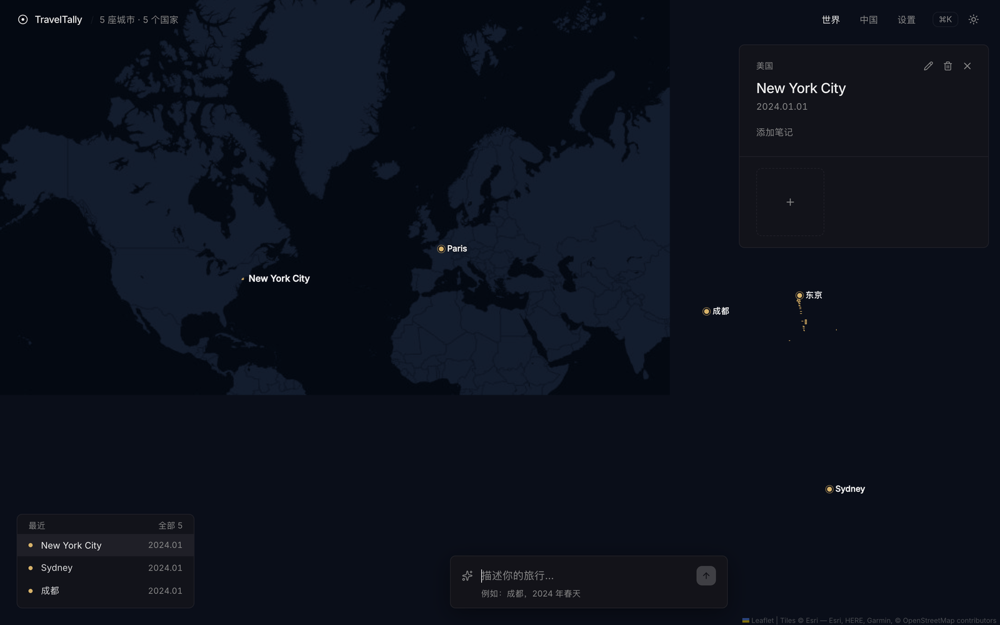
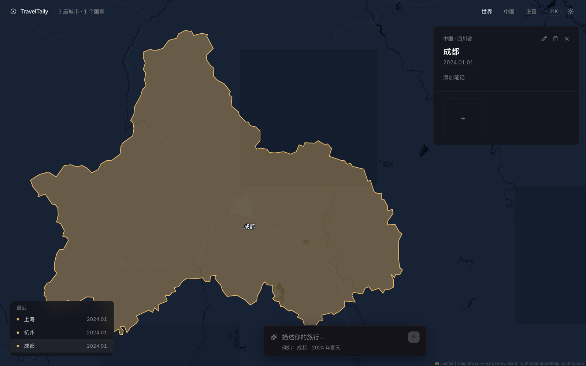
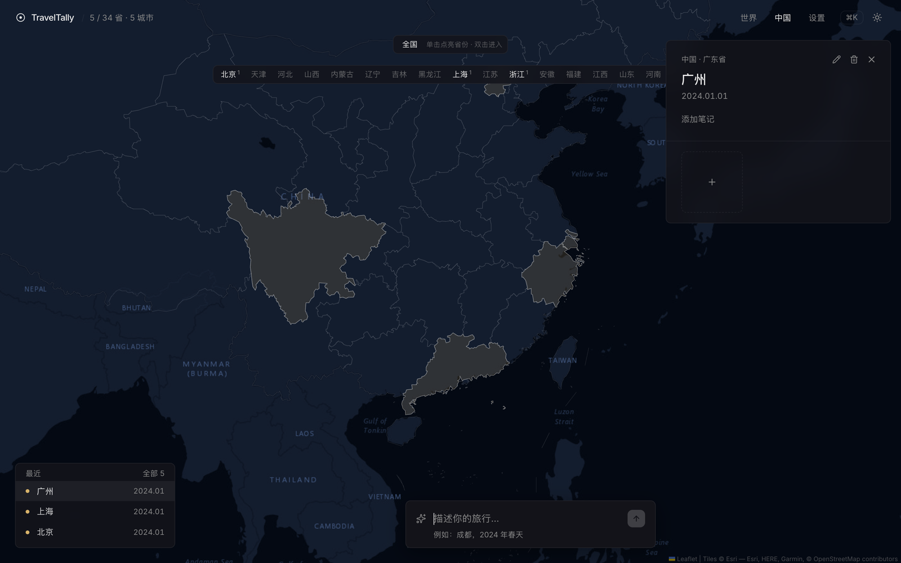
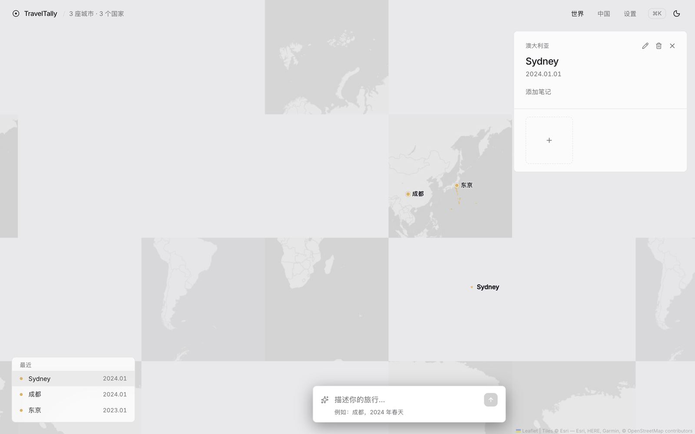
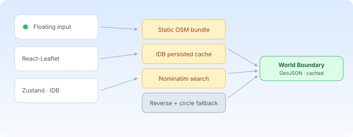

# TravelMap

> A private, beautiful, open-source personal travel map.
> Type a sentence about a trip you took; it lands on the map.

[](./LICENSE)
[](https://vitejs.dev)
[](https://react.dev)
[](https://www.typescriptlang.org)
[](https://react-leaflet.js.org)

[中文文档](./README.zh-CN.md)

---

## Why

Most travel-map apps ask for your email, sync to a cloud, and paywall the
good stuff. TravelMap opens in your browser, stores everything in IndexedDB,
and never asks you to log in. You write a sentence about a trip; the city
lights up on the map. That's it.

<p align="center">
  
</p>

## Demo

- Type `成都，去年春天` → Chengdu lights up with a date and a region fill.
- Type `京都` or `Kyoto` → the same city, your preferred script.
- Type `Reykjavik` → it's already in the curated set; works offline.
- Click any pin → the map flies to the city's real administrative outline.

<p align="center">
  
</p>

## Highlights

- **AI-native input** — `"去年去了成都和东京"` parses dates, cities, and trip
  kind. Multi-language: `京都` and `Kyoto` both work.
- **Real boundaries, not dots** — every city you add renders its actual
  administrative outline (Chengdu → 687k px² of real shape). Click on the
  world map flies to the boundary; click in China view drills province → city
  → district.
- **Offline-first** — a 385 KB bundle of 90+ high-traffic city boundaries
  ships in the repo (`public/osm-boundaries.json`). The most common cities
  never touch the network. Anything else falls back to Nominatim with a
  persistent IDB cache.
- **Private by default** — zero accounts, zero cloud. All data lives in
  IndexedDB. One-click JSON export/import for moving between devices.
- **Keyboard-friendly** — Tab to a city pin, Enter to select, click anywhere
  on the map to deselect.

## China view

Drill down from province → city → district. Click an empty province to
record "I was there"; click a lit one to open the drawer and add notes/photos.
The map fills smoothly with `tt-fill-in` animations.

<p align="center">
  
</p>

## Light theme

Same data, different palette. The CSS is hand-tuned so labels stay
legible on both palettes.

<p align="center">
  
</p>

## Architecture

<p align="center">
  
</p>

The lookup cascade `lookupBoundary(key)` checks, in order: in-memory cache
(warm from IDB on boot) → static bundle (`./osm-boundaries.json`) → IDB
persisted entries (across reloads) → live Nominatim (with a 1 req/sec
serial queue to respect the usage policy) → reverse-geocode the parent
admin area → fall back to a dashed bbox circle. The whole chain is
idempotent and never hammers upstream.

## Tech stack

| Layer | Choice | Why |
|---|---|---|
| Build | Vite 7 + TypeScript 5.8 | fast HMR, ESM-native |
| UI | React 19 + Framer Motion | concurrent rendering, declarative transitions |
| Map | react-leaflet 5 + Leaflet 1.9 | the de-facto standard; works offline once tiles cache |
| State | Zustand 5 + persist | tiny, no boilerplate, plays well with React 19 |
| Storage | IndexedDB via `idb` | OSM boundary GeoJSONs are too big for localStorage |
| Styling | Tailwind CSS 4 | fast, utility-first, good dark mode |
| Geocoding | Nominatim (`/search` + `/reverse`) | free, ODbL, no API key |
| Simplification | simplify-js (Douglas–Peucker) | every boundary → ≤ 1600 points |

## Quick start

```bash
# clone, install, run
git clone https://github.com/frankfika/travelmap.git
cd travelmap
npm install
npm run dev          # open http://localhost:5173

# build a static bundle you can self-host
npm run build        # → ./dist
npm run preview      # serve ./dist on http://localhost:4173
```

To rebuild the offline OSM boundary bundle (defaults to 90+ cities,
re-run if Nominatim data improves):

```bash
node scripts/build-osm-boundaries.mjs            # ~2 min, 1 req/sec
node scripts/retry-osm-boundaries.mjs /tmp/missing.json   # fill gaps
```

The city list lives at the top of `scripts/build-osm-boundaries.mjs` —
add a `{ name, cc, lat, lng }` entry and re-run.

## Development

| Command | What it does |
|---|---|
| `npm run dev` | Vite dev server on `:5173`, HMR for `src/` |
| `npm run build` | Type-check + production bundle to `dist/` |
| `npm run preview` | Serve the production bundle on `:4173` |
| `node scripts/verify-map.mjs` | 27-assertion e2e suite (requires dev server) |
| `node scripts/audit-e2e.mjs` | 10-assertion long-form e2e audit |

Both test scripts block Nominatim at the network layer — the entire
suite runs deterministically against the bundled OSM boundaries, so CI
never flakes on upstream rate-limits. Last green run:
27 / 27 + 10 / 10 with 0 Nominatim requests.

## Data flow at a glance

```
  "去年去了成都和东京"
            │
            ▼
  ┌──────────────┐         ┌──────────────────┐
  │  aiParser    │  ─────► │    ResolvedCity  │  zh name  +  Latin lookupName
  │  parseTravel │         │   + adcode        │
  └──────────────┘         │   + lat/lng        │
            │              └──────────────────┘
            ▼
  ┌──────────────────────────┐         ┌─────────────────────────┐
  │  lookupBoundary(key)     │  ─────► │ public/osm-boundaries   │
  │  in-mem → bundle → IDB → │         │ .json (385 KB, 90+)    │
  │  Nominatim → reverse      │         └─────────────────────────┘
  └──────────────────────────┘
            │
            ▼
       ┌─────────┐
       │  Place  │   boundaryKey, adcode, lookupName, lat/lng
       └─────────┘
```

## Roadmap

- [x] China provinces → cities → districts
- [x] World cities via Nominatim + offline bundle
- [x] Persistence in IndexedDB
- [x] Race-safe outline framing on click
- [x] 37-assertion e2e suite (verify-map + audit)
- [ ] Overpass API for ad-hoc cities (replace Nominatim `reverse` step)
- [ ] iOS / Android via Capacitor
- [ ] Multi-user share via signed URL (currently single-link sharing only)
- [ ] Photo upload to IndexedDB blob storage (already scaffolded)

## License

MIT — see [LICENSE](./LICENSE).

## Credits

- City data — [GeoNames](https://www.geonames.org/) (CC-BY 4.0)
- World boundaries — [OpenStreetMap](https://www.openstreetmap.org/)
  via [Nominatim](https://nominatim.openstreetmap.org/) (ODbL)
- China GeoJSON — [DataV.GeoAtlas](https://datav.aliyun.com/portal/school/atlas/area_selector)
- Map tiles — [OpenStreetMap](https://www.openstreetmap.org/) contributors (ODbL)
